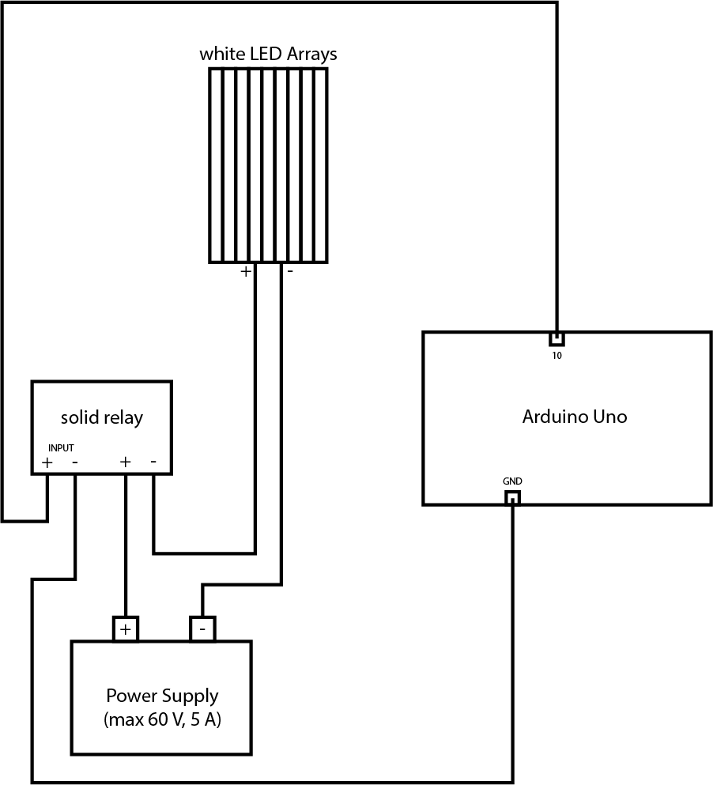

# Two-Channel Light Controller

Kang-Rui Leng, Ph.D candidate

Laboratory of Dr. Donggen Luo, College of Life Sciences, Peking University, Beijing

Email: krleng@pku.edu.cn

Created: Oct 17, 2024 ---- de FE_protocol

Last modified: Nov 3, 2024

## Introduction
The system controller is built using Arduino Uno and the Arduino programming language by [Arduino](https://www.arduino.cc). If you're new to Arduino, you can start from the [Arduino Guide](https://www.arduino.cc/en/Guide). The controller script, LD_controller.ino, was designed C/C++ amateur friendly. You can simpling modify a few input parameters of the script to program your protocol.

The most important parameter is the `LD[3][sectN]` array, which defines your protocol.

The `LD[3][sectN]` is a `3` $\times$ `sectN` (`3` rows, `sectN` columns) 2-D array, where the `sectN` represents the number of sections. Each cycle of LD or DD is separated into 2 individual sections. Each column represents the duration and all states in a section. The first row represents the duration of sections (in ms). The second row represents the state of SIGNAL I, such as white LEDs (1 for LED ON, 0 for LED OFF), The third row represents the state of SIGNAL II, such as a motor, 1 for ON, 0 for OFF. The rows are indexed as [0, 1, 2] and sections as [0, 1, …, sectN-1], for C/C++ counting from 0. 

Usually, to make flies acclimated to the incubator environment, our protocols start with a `D` section, and to exclude extra light influences, we prepare flies and mount the whole setup during the L section, that is, our valid data collecting starts from `LD 1` after an `LD 0`. And during the `L` section of `LD 0` (`LD[][0]`), we load flies in and assemble the setup as required, with the `D` section of `LD 0`  (`LD[][1]`) left for acclimation. Thus, the value of `LD[0][0]`, the duration of the first `L`, should be specified as the remaining time to the start of the `D` of `LD 0`. Similarly, the values of `LD[0][2]` and `LD[0][3]` are the durations for the `L` and `D` of `LD 1`; `LD[0][4]` and `LD[0][5]` for `LD 2`; …; `LD[0][2n]` and `LD[0][2n+1]` for `LD n`. 

To illustrate the structure of the `LD[3][sectN]` array, here is an example of a 10-section protocol:

|sect 0    | sect 1   | sect 2   | sect 3   | sect 4   | sect 5   | sect 6   | sect 7   | sect 8   | sect 9   |
|----------|----------|----------|----------|----------|----------|----------|----------|----------|----------|
| 43200000 | 43200000 | 43200000 | 43200000 | 43200000 | 43200000 | 43200000 | 43200000 | 43200000 | 43200000 |
| 1        | 0        | 1        | 0        | 1        | 0        | 1        | 0        | 1        | 0        |
| 0        | 0        | 0        | 0        | 0        | 0        | 1        | 0        | 1        | 0        |

In the above table, the first row represents the duration of each section in milliseconds. The second row represents the state of SIGNAL I, and the third row represents the state of SIGNAL II. The protocol has 10 sections, and each section lasts for 12 hours (43200000 ms). The protocol starts with a 12-hour `L` section, followed by a 12-hour `D` section, and then a 12-hour `L` section, and so on. The state of SIGNAL I alternates between 1 and 0, while the state of SIGNAL II remains 0 except for sections 6 and 8, that is , the SIGNAL II starts its ON/OFF cycle from `LD 3`. The `sect 0` is the `L` of `LD 0`, and the `sect 1` is the `D` of `LD 0`, and so on.

Accordingly, constant dark (DD) of SIGNAL I after $x$ complete LD cycles (note that LD 0 is an incomplete LD cycle) should be programmed by setting `LD[1][2x + 2 : sectN]` to 0, so the constant dark will start from the day ($x$ + 1). Similarly, constant ON of SIGNAL II should be coded by setting `LD[2][2m : 2k + 1]` to 1, where SIGNAL II will be constant ON during day $m$ to day $k$.

Usually, we regard two continuous sections as a so called "day", but sometimes it's necessary to shorten or extend the duration of a day, for example, to shift the day-night cycle or to make SIGNAL I and SIGNAL II have overlapping stages or different periods. For short, a single `section` is a specific time period with given states of SIGNAL I and SIGNAL II.

## Parameters

The parameters are declared at the beginning of the script, and you can modify them to program your protocol. Here is a list of the parameters you may need to modify:
```Arduino
const int 
    n = 2,
    shiftN = 2;
const int       
    pin[n] = { 13, 12 }, // n pins with n frequencies to blink
    pin_on = 10, // constant on in L, constant off in D
    pin_on_rev = 9,  // constant on in D, constant off in L
    pin_motor[2] = { 3, 2 }, // pin_motor[0] on <- L, pin_motor[1] on <- D.
    pinRead = A0,
    dayN = 60, //// MODIFY //// LD[][0:1] is LD0, for acclimation, LD[][2:3] is LD1, the proper start of LD cycles
    dayShift[shiftN] = { 2, 4 }, // the L of (x+1)-th day will be shifted by shiftTime[] ms
    sectN = dayN * 2 + 2; // # of sections in LD sequences 
const double
    f[n] = { 2, 2 }, // in Hz
    dutyCycle[n] = { 1, 1 }; // used to calculate PW when PW is set to {0}.
double
    interval[n] = { 0 },
    PW[n] = { 0, 0 }; // in ms; if set to 0, PW will be calculated by duty cycle.
int sect_i = 0;
unsigned long 
    LD[3][sectN] = { 0 },
    shiftTime[shiftN] = { (8 * 60) * 60000, (8 * 60) * 60000 }, // in ms; x min * 60000 ms/min
    ...

...
void FillLDSections() 
{
    ...
}
```

see more usage of Arduino programming language at [Arduino Language Reference](https://docs.arduino.cc/language-reference/).


## Two SIGNALs
the `pin[n]`, `pin_on`, `pin_on_rev` are controlled by SIGNAL I, and the `pin_motor[2]` is controlled by SIGNAL II. The `pinRead` is used to read the light intensity when wired to a sensor. 

When __SIGNAL I__ is ON, all pins in `pin[n]` will blink with the frequencies defined in `f[n]`, and `pin_on` will be ON and `pin_on_rev` will be OFF. When SIGNAL I is OFF, all pins in `pin[n]` and `pin_on` will be OFF, but `pin_on_rev` will be ON.

For `pin[n]`, the `PW[n]` is used to set the pulse widths (PW) of the blinking signals. If `PW[n]` is set to 0, the PW will be calculated by the duty cycle defined in `dutyCycle[n]`. The `PW[n]` takes precedence over the `dutyCycle[n]`. The `interval[n]` will be calculated automatically, so please left it as 0.

When __SIGNAL II__ is ON, `pin_motor[0]` will be ON and `pin_motor[1]` will be OFF, vice versa.

Usually, SIGNAL I is enough for most experiments with LD cycles and than free run in DD cycles. 

## Shifts
The `dayShift[shiftN]` is used to easily shift the LD cycles, __where `shiftN` is the times of LD cycles to shift__. The `shiftTime[shiftN]` is the time to shift. These two variables should be set in pairs. The corresponding `shiftTime` will be added to the `D` section of the day in `dayShift`, which is the `sect (2m + 1)` where $m$ is the day in `dayShift`. 

for example, if you need to delay the LD 3 by 8 hours, you can set 

```Arduino
...
shiftN = 1;
...

dayShift[shiftN] = { 2 }, 
shiftTime[shiftN] = { (8 * 60) * 60000 },
```

 If we apply this shift to the above table, it will look like

|sect 0    | sect 1   | sect 2   | sect 3   | sect 4   | sect 5   | sect 6   | sect 7   | sect 8   | sect 9   |
|----------|----------|----------|----------|----------|----------|----------|----------|----------|----------|
| 43200000 | 43200000 | 43200000 | 43200000 | 43200000 | 72000000 | 43200000 | 43200000 | 43200000 | 43200000 |
| 1        | 0        | 1        | 0        | 1        | 0        | 1        | 0        | 1        | 0        |
| 0        | 0        | 0        | 0        | 0        | 0        | 1        | 0        | 1        | 0        |


In the above example, the shift will be applied once at the end of the second "day". The `D` of the `LD 2` (`sect 5`) will be extended by 8 hours to 20 hours (72000000 ms).

If you need to advance the LD 3 by 8 hours, you can simply set the `shiftN` to 1 and the `shiftTime[shiftN]` to a negative value, for example,

```Arduino
...
shiftN = 1;
...

dayShift[shiftN] = { 2 },
shiftTime[shiftN] = { -(8 * 60) * 60000 },

```

In another case, you may need to shift the cycles more than once, for example, you need to delay the LD 3 by 8 hours and advance the LD 6 by 4 hours, you can set

```Arduino
...
shiftN = 2;
...

dayShift[shiftN] = { 2, 5 },
shiftTime[shiftN] = { (8 * 60) * 60000, -(4 * 60) * 60000 },
```

If you don't need to shift the cycles, please set the `shiftTime[m]` to { 0 }, e.g. 

```Arduino
...
shiftN = 1;
...

dayShift[shiftN] = { 0 },
shiftTime[shiftN] = { 0 },
```

__Please note that the `shiftTime[shiftN]` should be set in pairs with `dayShift[shiftN]`, and the number of elements in `{ }` should exactly equals to `shiftN`.__

## Set protocol

The `LD[3][sectN]` array is used to define the protocol. You can set the durations and states of SIGNAL I and SIGNAL II in each section. The `sectN` is the number of sections in the protocol. The first row of the array represents the duration of each section in milliseconds. The second row represents the state of SIGNAL I, and the third row represents the state of SIGNAL II.

The `LD[3][sectN]` is declared in the parameters part with all 0's in it. You can easily set the duration of each section and states of the two signals in the function `void FillLDSections()`.

Usually, we initialize the `LD[3][sectN]` as 12-hour/12-hour LD cycles, and then modify the durations and states of the sections as needed.

Suppose we have a 10-section protocol (sectN = 10 and dayN = 4), we can initialize the `LD[3][sectN]` as follows:

```Arduino
void FillLDSections() 
{
    for (int i = 0; i < sectN; i++) 
    {
        if (i % 2 == 0) // when i is even, it's L
        {
            LD[0][i] = 43200000; // 12 hours in ms
            LD[1][i] = 1; // SIGNAL I ON
            LD[2][i] = 1; // SIGNAL II ON
        }
        else // when i is odd, it's D
        {
            LD[0][i] = 43200000; // 12 hours in ms
            LD[1][i] = 0; // SIGNAL I OFF
            LD[2][i] = 0; // SIGNAL II OFF
        }
    }
    ...
}
```
(see more of the `for` loop at [Arduino language structure - for](https://docs.arduino.cc/language-reference/en/structure/control-structure/for/).)

Using the above code, the `LD[3][sectN]` will be initialized as

|sect 0    | sect 1   | sect 2   | sect 3   | sect 4   | sect 5   | sect 6   | sect 7   | sect 8   | sect 9   |
|----------|----------|----------|----------|----------|----------|----------|----------|----------|----------|
| 43200000 | 43200000 | 43200000 | 43200000 | 43200000 | 43200000 | 43200000 | 43200000 | 43200000 | 43200000 |
| 1        | 0        | 1        | 0        | 1        | 0        | 1        | 0        | 1        | 0        |
| 1        | 0        | 1        | 0        | 1        | 0        | 1        | 0        | 1        | 0        |


The time shifts in the [**Shifts**](#shifts) will be applied here after the initialization of the `LD[3][sectN]`. e.g.

with the one of the above examples of the shifts

```Arduino
...
shiftN = 1;
...

dayShift[shiftN] = { 2 },
shiftTime[shiftN] = { -(8 * 60) * 60000 },

```

the `LD[3][sectN]` will be modified by the `shiftN`, `dayShift[shiftN]` and `shiftTime[shiftN]` in the `FillLDSections()` function. In this case, an 8-h advance of the LD 3 will be applied.

```Arduino
void FillLDSections() 
{
    ...
    for (int i = 0; i < shiftN; i++)
    {
        LD[0][dayShift[i] * 2 + 1] += shiftTime[i];
    }
    ...
}
```
This will modify the `LD[3][sectN]` to 

|sect 0    | sect 1   | sect 2   | sect 3   | sect 4   | sect 5   | sect 6   | sect 7   | sect 8   | sect 9   |
|----------|----------|----------|----------|----------|----------|----------|----------|----------|----------|
| 43200000 | 43200000 | 43200000 | 43200000 | 43200000 | 14400000 | 43200000 | 43200000 | 43200000 | 43200000 |
| 1        | 0        | 1        | 0        | 1        | 0        | 1        | 0        | 1        | 0        |
| 1        | 0        | 1        | 0        | 1        | 0        | 1        | 0        | 1        | 0        |

It's applicable to change the durations of specific sections directly to achieve the desired shifts, too. The `shiftN`, `dayShift[shiftN]` and `shiftTime[shiftN]` are just used to easily and stereotypically shift the LD cycles.

Usually, after some LD cycles, the experiments will be set to DD, and the `LD[3][sectN]` will be modified to DD by setting the `LD[1][2x + 2 : sectN]` to 0, where $x$ is the number of complete LD cycles or "days".

e.g. if we need to set the DD after LD 3 (sect 6-7), we can set

```Arduino
void FillLDSections() 
{
    ...
    for (int i = 8; i < sectN; i++) 
    {
        LD[1][i] = 0; // SIGNAL I OFF
        LD[2][i] = 0; // SIGNAL II OFF
    }
}
```

This will modify the `LD[3][sectN]` to

|sect 0    | sect 1   | sect 2   | sect 3   | sect 4   | sect 5   | sect 6   | sect 7   | sect 8   | sect 9   | ... |
|----------|----------|----------|----------|----------|----------|----------|----------|----------|----------| --- |
| 43200000 | 43200000 | 43200000 | 43200000 | 43200000 | 14400000 | 43200000 | 43200000 | 43200000 | 43200000 | ... |
| 1        | 0        | 1        | 0        | 1        | 0        | 1        | 0        | 0        | 0        | ... |
| 1        | 0        | 1        | 0        | 1        | 0        | 1        | 0        | 0        | 0        | ... |

As is mentioned in the [**Introduction**](#introduction), the experiments usually start with the `L` shorter than 12 hours of `LD 0`, and the `LD[0][0]` should be set to the remaining time to the start of the `D` of `LD 0`. So, if now is 16:23, and the `D` of `LD 0` starts at 20:00, the `LD[0][0]` should be set to 3 hours and 37 minutes, that is, 13020000 ms.

```Arduino
void FillLDSections() 
{
    ...
    LD[0][0] = (3 * 60 + 37) * 60000; // 3 hours and 37 minutes in ms
    ...
}
```

This will modify the `LD[3][sectN]` to

|sect 0    | sect 1   | sect 2   | sect 3   | sect 4   | sect 5   | sect 6   | sect 7   | sect 8   | sect 9   | ... |
|----------|----------|----------|----------|----------|----------|----------|----------|----------|----------| --- |
| 13020000 | 43200000 | 43200000 | 43200000 | 43200000 | 14400000 | 43200000 | 43200000 | 43200000 | 43200000 | ... |
| 1        | 0        | 1        | 0        | 1        | 0        | 1        | 0        | 0        | 0        | ... |
| 1        | 0        | 1        | 0        | 1        | 0        | 1        | 0        | 0        | 0        | ... |

Then, the full inialization of `void FillLDSections()` will be

```Arduino
void FillLDSections() 
{
    // fill the LD[3][sectN] array to alternate between L and D
    for (int i = 0; i < sectN; i++) 
    {
        if (i % 2 == 0) // when i is even, it's L
        {
            LD[0][i] = 43200000; // 12 hours in ms
            LD[1][i] = 1; // SIGNAL I ON
            LD[2][i] = 1; // SIGNAL II ON
        }
        else // when i is odd, it's D
        {
            LD[0][i] = 43200000; // 12 hours in ms
            LD[1][i] = 0; // SIGNAL I OFF
            LD[2][i] = 0; // SIGNAL II OFF
        }
    }

    // apply the time shifts
    for (int i = 0; i < shiftN; i++)
    {
        LD[0][dayShift[i] * 2 + 1] += shiftTime[i];
    }

    // set the DD after LD 3
    for (int i = 8; i < sectN; i++) 
    {
        LD[1][i] = 0; // SIGNAL I OFF
        LD[2][i] = 0; // SIGNAL II OFF
    }

    // set the remaining time to the start of the D of LD 0
    LD[0][0] = (3 * 60 + 37) * 60000; // 3 hours and 37 minutes in ms
}
```
However, sometimes the experiments need to start in the middle of a `D`, so you can simply set the `LD[0][0]` to 0, and customize the `LD[0][1]` to the remaining time to the start of the `L` of `LD 1`.

```Arduino
void FillLDSections() 
{
    ...
    LD[0][0] = 0; // 3 hours and 37 minutes in ms
    LD[0][1] = (3 * 60 + 37) * 60000; // 3 hours and 37 minutes in ms
    ...
}
```

This will modify the `LD[3][sectN]` to

|sect 0    | sect 1   | sect 2   | sect 3   | sect 4   | sect 5   | sect 6   | sect 7   | sect 8   | sect 9   | ... |
|----------|----------|----------|----------|----------|----------|----------|----------|----------|----------| --- |
| 0        | 13020000 | 43200000 | 43200000 | 43200000 | 14400000 | 43200000 | 43200000 | 43200000 | 43200000 | ... |
| 1        | 0        | 1        | 0        | 1        | 0        | 1        | 0        | 0        | 0        | ... |
| 1        | 0        | 1        | 0        | 1        | 0        | 1        | 0        | 0        | 0        | ... |

You can always customize your protocol by modifying the `LD[3][sectN]` in the `void FillLDSections()` function, where all the durations and states of all sections can be freely assigned. 

## About time assignment
The time assignment in the `LD[3][sectN]` is in milliseconds. so you can always write the time directly in ms, or use the `* 60000` to convert the time in minutes to ms.

e.g. you can directly set the `LD[0][0]` to 12 hr by

```Arduino
...
LD[0][0] = 43200000; // 12 hours in ms
...
```

or write the time in minutes and convert it to ms by

```Arduino
...
LD[0][0] = (12 * 60) * 60000; // 12 hours in ms
...
```

**In the later case, the multiplication is not totally free and you can only use the `* 60000` following a number in minutes. So you can't write it as `(12 * 60) * 60 * 1000` or other forms due to potential overflows during compilation. For safety reasons, you can always write the time directly in ms.**

## About blinking frequencies

you can set a varying frenquency in the `double fx(unsigned long ti, unsigned long td)` function

e.g.

```Arduino
double fx(unsigned long ti, unsigned long td) // ti is the elapsed time in section i, td is the duration of section i
{ // frequency f = f0 * fx; interval I = I0 / fx;
    double x = (double)ti / td; // varies in [0,1] as a time factor for normalization ;
    double y = (-cos(x * 2 * PI) + 1) / 2;
    y = 1;
    if (y < 0) y = 0;
    return y;
}
```

## Appendices


Figure 1 - Circuits diagram of the light controller. 